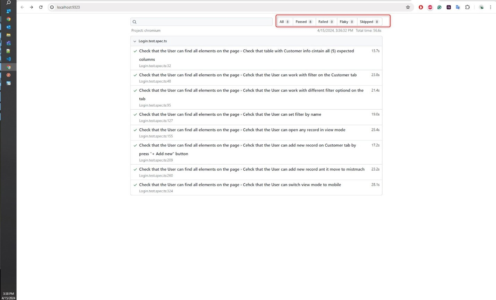

# Practical Task
## Contents
- [E2E тесты](#e2e-test)
    - [Описание выполненных тестов](#test-description-implemented)
    - [Описание отложенных тестов](#test-description-postponed)

- [Приложения](#applications)
    - [Скриншот о выполненных E2E тестах](#applications-e2e)

## <a name="#e2e-test">E2E тесты</a>
### <a name="#test-description-implemented">Описание выполненных тестов</a>
- [Ссылка на репозиторий](https://github.com/kaptikova/Practical_task)
- [JS-файл с тестами](./tests/Login.test.spec.ts)
- [Отчет о выполненных тестах](./playwright-report/index.html)

В рамках выплднения тестового задания, мною были написаны чек-листы для проверки функционала.
Хочу отметить, что в условиях ограниченного времени и отсутсвия информации об ожидаемом результате тестов мною были проведены следующие проверки:

1.	Проверка того, что пользователь может залогиниться на сайте при вводе полученных после регистрации пары логин/пароль
2.	Проверка того, что пользователь может перейти в секцию Companies
3.	Провека того, что  пользователь может перейти в секцию Customer
4.	Проверка того, что на странице Customer отображаются все 6 столбцов (Select all, Action, Name, Industry, Employees, Created at)
5.	Провека того, что  пользователь может работать с фильтром, а именно:
    - Кнопка фильтр работает и при нажатии открывается форма настройки фильтра
    - Форму можно закрыть по нажатию кнопки Reset
    - На форме пользователь может выставить нужные параметры фильтрации, такие как: 
        - “Any” options
        - Filter by “Created at”
        - Filter by “Name”
6.	Провека того, что  пользователь может выбрать произвольную записть на гриде Customer, например "Judith May, Robinetworks" и нажать кнопку “Details” для выбранной записи 
7.	Провека того, что  после нажатия кнопки “Details” пользователь может перейти по подсекциям открывающегося окна с деталями о выбранной записи:
    - Пользователь может перейти по всем видимым вкладкам: “Details”, “Notes”, “Orders”, “Contacts”
8.	Провека того, что  пользователь может перейти на вкладку “Notes” и добавить новую запись по нажатию кнопки “+ Add new”:
    - Проверка того, что после нажатия кнопки отображается форма в которой пользователь может ввести данные
    - Проверка того,  что пользователь может сохранить внесенные данные по кнопке “Submit”
    - Проерка того, что внесенная пользователем запись отображается на вкладке “Notes”
9.	Провека того, что  пользователь может добавить новую запись о Customer по нажатию кнопки “+ Add new”:
    - Проверка того, что после нажатия кнопки отображается форма добавления новой сущности 
    - Проверка наличия обязательных полей на форме
    - Проверка того, что без обязательных полей пользователь не может создать сущность
    - Проверка возможности заполнения обязательных полей 
    - Проверка того, что после заполнения обязательных полей и нажатия кнопки “Submit” запись не отображается на странице Customer
    - Проверка того, что добавленная пользователем сущность отображается на вкладке “Mismatch”
10.	Проверка того, что пользователь может перейти в mobile mode и выполнить такие действия как:
    - Переместиться по существующим вкладкам
    - Переместиться в рамках одной вкладки, но по разным страницам
    - Изменить количество отображаемых элементов на вкладке

### <a name="#test-description-postponed">Описание отложенных тестов</a>
Также хочу отметить, что часть проверок была опущена с целью сокращения времени написания тестов и их отладки:
1.	Возможность пользователя зарегистрироваться на сайте 
2.	Возможность работать с данными на вкладке All Companies
3.	Возможность фильтрации данных на вкладке All Companies
4.	Возможность добавления новой сущности на вкладке All Companies по нажатию кнопки “+ Add new”
5.	Возможность пользователя переходить по вкладкам: “Trial”, “User”, “Prospect”
    - Возможность пользователя просматривать инфомрацию о выбранной сущности на каждой из вкладок, по кнопке “View”
    - Возможность пользователя фильтровать данные на указанных вкладках
    - Возможность пользователя добавлять новые сущности на указанные вкладки, по кнопке “+ Add new”
6.	При выборе произвольной записи на странице Customer не проверялось:
    - Возможность выбора более 1 записи на странице Customer
    - Возможность добавлять новые записи на каждую вкладку при просмотре деталей о выбранной записи на странице Customer
    - Возможность добавления изображений 
7.	Возможность удаления любой сущности 
8.	Причина отображения добавленной записи Customer на на странице Customer, а на странице Mismatch

## <a name="#applications">Приложения</a>
### <a name="#applications-e2e">Скриншот о выполненных E2E тестах</a>

